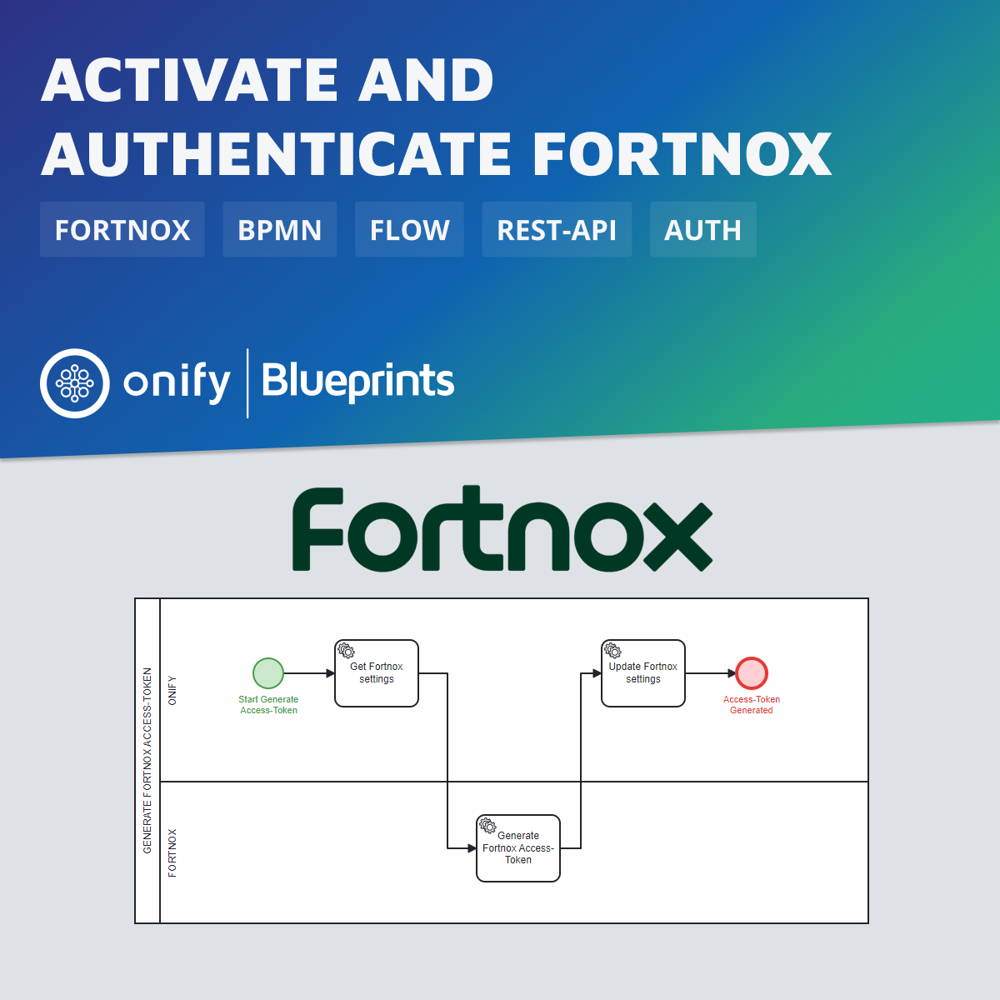

[](https://www.repostatus.org/#wip)

# Onify Blueprint: Activate and authenticate Fortnox integration

[Fortnox](https://fortnox.com/) is a Swedish ERP company that delivers a cloud-based business platform for financial management. In this Blueprint we Activate the integration between Fortnox and Onify.



## Requirements

* [Onify Hub](https://github.com/onify/install)
* [Fortnox](https://freshservice.com/)

## Included

* 3 x Flows
* 1 x Form
* 2 x Settings

## Setup

### Resources

Copy `.\resources\*` to your Onify Hub resources

### Settings

Add the following settings via `/admin/settings`.

|Key|Name|Description|Value|Type|Tag|Role|
|---|----|-----------|-----|----|---|----|
|fortnox_app_clientid|fortnox_app_clientid|Onify App Client Id|JBL1UVnvfo4y|string|fortnox,frontend|admin|
|fortnox_app_clientsecret|fortnox_app_clientsecret|Onify App Client Secret|*******|password|fortnox|admin|

> Please contact support@onify.co to get the `fortnox_app_clientsecret` value.

### Configuration

Import configuration for **forms** and **flows** using the following command;

```bash
curl -X POST "<ONIFY-HUB-API-URL>/api/v2/setup/database/config/import" -H "accept: application/json" -H "authorization: <AUTH-TOKEN>" -H "Content-Type: application/json" -d "@./config.json" --insecure
```

## Activate (and authenticate) integration with Fortnox

1. Go to `<ONIFY-HUB-APP-URL>/form/fortnox-activate`
2. Validate _Form URL_ (and modify if needed)
3. Validate _Scopes_ (and modify if needed)
4. Click _Generate activation URL_ 
5. Click on the generated action link
6. Enter username and password for Fortnox
7. Approve access for user and Onify
8. Validate _Authentication code_
9. Click _Activate Onify in Fortnox_ 

> For more information about authenticating against Fortnox, please read [Authorizing your integration](https://developer.fortnox.se/general/authentication/).

### Authenticate and refresh access-token

`fortnox-refresh-access-token.bpmn` is used for refreshing the access-token. The Access Token is valid 1 hours the Refresh Token is valid for 31 days. So make sure you refresh the Refresh Token before it expires and you have to reactivate the integration again.

## Support

* Community/forum: https://support.onify.co/discuss
* Documentation: https://support.onify.co/docs
* Support and SLA: https://support.onify.co/docs/get-support

## License

This project is licensed under the MIT License - see the [LICENSE](LICENSE) file for details.
